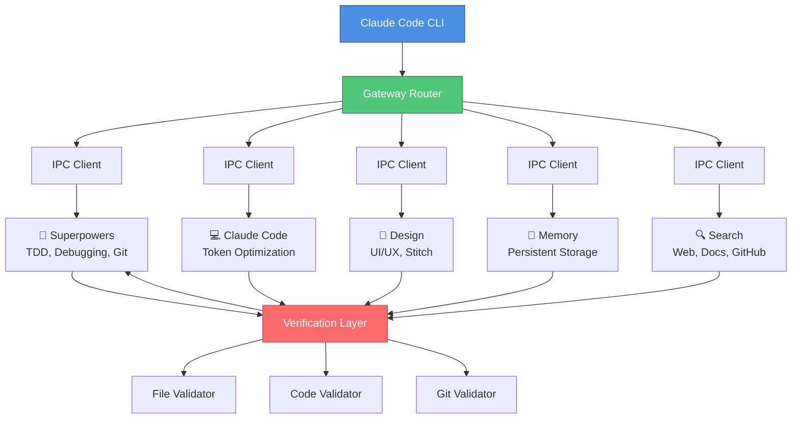
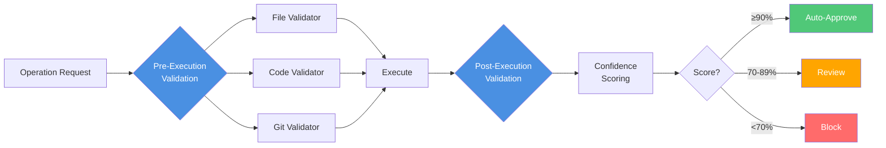

<div align="center">
  
  <br/>

  # 🤖 SoulAI

  **Open-source workflow agent combining 5 MCP servers with anti-hallucination guarantees**

  [](https://github.com/HazimKhairi/Project-SoulAI)
  [](https://github.com/HazimKhairi/Project-SoulAI)
  [](LICENSE)
  [](https://nodejs.org)
  [](CONTRIBUTING.md)

  [📖 Documentation](docs/) | [🎯 Examples](#-quick-start) | [💬 Discord](#) | [🐛 Issues](https://github.com/HazimKhairi/Project-SoulAI/issues)

</div>

---

## 🌟 What is SoulAI?

**SoulAI** is a multi-server orchestrator that combines 5 independent submodules into a unified workflow agent. The sweet spot between **low-code automation** and **enterprise-grade reliability**.

```bash
npm install -g soulai
soulai start
```

### Key Features

- 🎯 **Multi-Server Architecture** - 5 independent MCP servers via Unix sockets
- 🛡️ **Anti-Hallucination System** - 11-component verification (5 validators + 3 strategies + 3 guardrails)
- 🔄 **Auto-Recovery** - Crashed servers restart automatically (max 3 retries)
- 📊 **Plan Optimization** - Auto-adjusts based on Claude plan (Free/Pro/Team/Enterprise)
- 🎨 **Custom AI Names** - Personalize your AI (SoulAI, Revo, EjenAli, etc.)

---

## 🏗️ Architecture

<div align="center">



</div>

### 🎯 Server Ecosystem

<table>
  <tr>
    <td align="center" width="20%">
      <b>🦸 Superpowers</b><br/>
      <sub>TDD Workflows<br/>Debugging<br/>Git Worktrees</sub>
    </td>
    <td align="center" width="20%">
      <b>💻 Claude Code</b><br/>
      <sub>Token Optimization<br/>Parallel Agents<br/>Context Management</sub>
    </td>
    <td align="center" width="20%">
      <b>🎨 Design</b><br/>
      <sub>UI/UX Components<br/>Stitch Integration<br/>Design Systems</sub>
    </td>
    <td align="center" width="20%">
      <b>🧠 Memory</b><br/>
      <sub>In-Memory Map<br/>Disk Persistence<br/>Cross-Session</sub>
    </td>
    <td align="center" width="20%">
      <b>🔍 Search</b><br/>
      <sub>Web Search<br/>Docs Search<br/>GitHub Integration</sub>
    </td>
  </tr>
</table>

---

## ⚡ Quick Start

### Installation

```bash
# Clone repository
git clone https://github.com/HazimKhairi/Project-SoulAI.git
cd Project-SoulAI

# Install dependencies
npm install

# Install globally
npm link

# Initialize configuration
soulai init
```

### Usage

```bash
# Start SoulAI orchestrator
soulai start

# Check server status
soulai status

# Stop all servers
soulai stop
```

### Example: Test-Driven Development

```javascript
// In Claude Code
claude> Use TDD workflow to implement user authentication

// SoulAI orchestrates:
// 1. Superpowers: TDD pattern
// 2. Code: Implementation
// 3. Verification: Validation
// 4. Memory: Store context
```

---

## 🛡️ Anti-Hallucination System

<div align="center">



</div>

### Verification Pipeline

| Component | Type | Purpose |
|-----------|------|---------|
| **File Validator** | Validator | Ensures files exist before operations |
| **Code Validator** | Validator | Validates syntax and structure |
| **Dependency Validator** | Validator | Checks package dependencies |
| **Git Validator** | Validator | Verifies repository state |
| **Claim Validator** | Validator | Validates AI assertions |
| **Pre-execution** | Strategy | Validates prerequisites |
| **Post-execution** | Strategy | Validates results |
| **Diff Analyzer** | Strategy | Compares before/after states |
| **Hallucination Detector** | Guardrail | Prevents false assertions |
| **Human Review** | Guardrail | Human-in-the-loop for high-risk ops |
| **Confidence Scoring** | Guardrail | Rates reliability (A-F grades) |

---

## 📊 Plan Optimization

SoulAI automatically adjusts resources based on your Claude plan:

<div align="center">

| Plan | Max Agents | Token Budget | Context Window |
|------|-----------|--------------|----------------|
| **Free** | 1 | 50K | Minimal |
| **Pro** | 2 | 150K | Medium |
| **Team** ⭐ | 5 | 500K | Large |
| **Enterprise** | 10 | 2M | Unlimited |

</div>

### Configuration

```json
{
  "aiName": "MyAI",
  "plan": "team",
  "optimization": {
    "maxAgents": 5,
    "tokenBudget": 500000,
    "contextWindow": "large"
  }
}
```

Or use environment variables:

```bash
export SOULAI_AI_NAME="Revo"
export SOULAI_PLAN="team"
```

---

## 🎨 Features

<details>
<summary><b>🔄 Auto-Recovery System</b></summary>

Automatic server recovery with:
- Crash detection via process monitoring
- 2-second delay between restart attempts
- Maximum 3 retry attempts
- Auto-disable after 3 consecutive failures
- Counter reset on successful restart

```
[Start] → [Initialize] → [Running] → [Monitoring]
                              ↓
                         [Crash?] → [Recovery]
                              ↓
                         [Retry] → [Success/Fail]
                              ↓
                         [Max 3] → [Disable]
```

</details>

<details>
<summary><b>⚙️ 3-Layer Configuration</b></summary>

Configuration merge priority:
1. **Default Config** (`config/default.json`) - Lowest priority
2. **User Config** (`~/.soulai/config.json`) - Medium priority
3. **Environment Variables** - Highest priority

```javascript
// Layer 1: Default
{ "plan": "free", "maxAgents": 1 }

// Layer 2: User config
{ "plan": "team" }

// Layer 3: Environment
SOULAI_PLAN="enterprise"

// Result: plan="enterprise", maxAgents=1
```

</details>

<details>
<summary><b>🧠 Memory Management</b></summary>

Dual-layer memory system:
- **In-Memory Map**: Fast access for active sessions
- **Disk Persistence**: Durability across restarts
- **Storage Location**: `~/.soulai/memory/`
- **Auto-Save**: Periodic disk sync

</details>

<details>
<summary><b>📝 Custom AI Names</b></summary>

Personalize your AI assistant:

```bash
# Revo
export SOULAI_AI_NAME="Revo"

# EjenAli
export SOULAI_AI_NAME="EjenAli"

# Alice
export SOULAI_AI_NAME="Alice"
```

**Validation rules**:
- 1-20 characters
- Alphanumeric + hyphens/underscores
- No special characters

</details>

---

## 🧪 Testing

SoulAI uses Test-Driven Development (TDD) with comprehensive coverage.

```bash
# Run all tests (86 passing)
npm test

# Run with coverage (85%+)
npm test:coverage

# Watch mode
npm test:watch
```

### Test Structure

```
tests/
├── unit/           # Unit tests (60% coverage)
├── integration/    # Integration tests (30%)
└── e2e/            # End-to-end tests (10%)
```

---

## 🤝 Contributing

We welcome contributions! See [CONTRIBUTING.md](CONTRIBUTING.md) for guidelines.

### Quick Guide

```bash
# 1. Fork and clone
git clone https://github.com/your-username/Project-SoulAI.git

# 2. Create feature branch
git checkout -b feature/my-feature

# 3. Write tests first (TDD)
npm test  # Should fail (RED)

# 4. Implement feature
# ... code ...

# 5. Run tests
npm test  # Should pass (GREEN)

# 6. Submit PR
git push origin feature/my-feature
```

---

## 📚 Documentation

<div align="center">

| Document | Description |
|----------|-------------|
| [📖 Installation Guide](docs/INSTALLATION.md) | Step-by-step setup instructions |
| [⚙️ Configuration](docs/CONFIGURATION.md) | Configuration reference |
| [🏗️ Architecture](docs/ARCHITECTURE.md) | System architecture deep-dive |
| [🛡️ Anti-Hallucination](docs/ANTI-HALLUCINATION.md) | Verification system details |
| [🔌 API Documentation](docs/API.md) | API reference |

</div>

---

## 🐛 Troubleshooting

<details>
<summary><b>Socket Connection Failed</b></summary>

```bash
# Check server status
soulai status

# Clean up old sockets
rm -f ~/.soulai/sockets/*.sock

# Restart
soulai stop && soulai start
```

</details>

<details>
<summary><b>Server Crash Loop</b></summary>

```bash
# Check logs
tail -100 ~/.soulai/logs/soulai.log

# Reset crash counter
soulai stop && soulai start

# Disable problematic server
echo '{"servers":{"search":{"enabled":false}}}' > ~/.soulai/config.json
```

</details>

<details>
<summary><b>High Token Usage</b></summary>

```bash
# Lower plan settings
export SOULAI_PLAN="free"

# Reduce agents
cat > ~/.soulai/config.json << EOF
{
  "optimization": {
    "maxAgents": 1,
    "tokenBudget": 30000
  }
}
EOF
```

</details>

---

## 📄 License

MIT License - see [LICENSE](LICENSE) file for details.

---

## 👥 Authors

<div align="center">

**HakasAI + Hazim**

Co-Authored-By: Claude Sonnet 4.5 <noreply@anthropic.com>

[](https://github.com/HazimKhairi)
[](#)

**Built with ❤️ using Claude Code**

</div>

---

<div align="center">

### ⭐ Star us on GitHub — it motivates us a lot!

[⬆ Back to Top](#-soulai)

</div>
